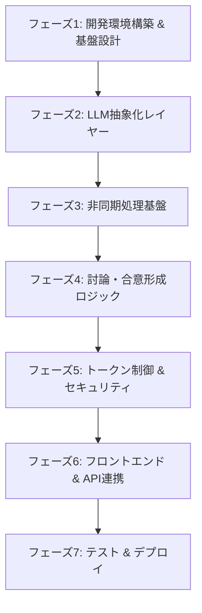
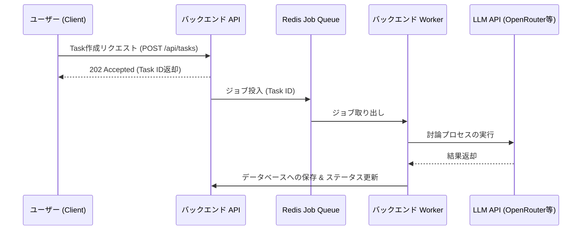

# 実装方針および詳細設計 (Implementation Plan & Design) - Counail

本ドキュメントは、要件定義書（`docs/specification.md`）に示された仕様に基づき、システムをどのような順序で、どのように具体的な技術要素を用いて構築していくかを定義したロードマップおよび設計書である。

---

## 1. 全体実装ロードマップ

開発は以下の7つのフェーズに分割して進行する。各フェーズは前フェーズの成果物に依存するため、原則としてこの順序で実装を進める。



---

## 2. 各フェーズの詳細実装方針

### フェーズ1: 開発環境構築と基盤設計 (Infrastructure & Base Setup)

本フェーズでは、システム全体の骨組みとなる開発環境の初期化と、データベースの設計を行う。

#### 1. プロジェクト初期化
- **Frontend**: `npx create-next-app` を用いて Next.js (App Router, TypeScript, TailwindCSS) プロジェクトを初期化する。
- **Backend**: Go (Gin または Fiber を採用) または FastAPI (Python) を用いてバックエンドプロジェクトを初期化する。
  - *方針*: 高い並列処理能力と型安全性を重視し、バックエンドは **Go** を選定する。

#### 2. データベース（Supabase/PostgreSQL）スキーマ設計
Supabase 上に以下のテーブルを作成する。
- `users`: ユーザー情報および設定。
- `api_keys`: ユーザーが登録した暗号化されたBYOK用のキー（OpenAI, Anthropic 等）。
- `tasks`: ユーザーが依頼したTask情報、Goal Type、ステータス。
- `agent_configs`: チームまたはタスクに紐づくAgentの構成定義。
- `debate_sessions`: 討論セッションの履歴、トークン・コスト総消費量。
- `debate_messages`: 各Agentが発言したログ、レビュー内容。
- `consensus_results`: 最終的な合意事項、不一致事項、未決事項。

#### 3. Redis 環境のセットアップ
- ローカル検証用および本番用の Redis インスタンスを準備する。

---

### フェーズ2: LLM 抽象化レイヤーの実装 (LLM Integration Layer)

多様なLLMプロバイダーへの要求を統一的に処理するインターフェースを実装する。

#### 1. 共通インターフェースの定義 (Go)
```go
type LLMProvider interface {
    Generate(ctx context.Context, req *GenerateRequest) (*GenerateResponse, error)
    Stream(ctx context.Context, req *GenerateRequest) (<-chan *StreamChunk, error)
}
```
- `GenerateRequest` には、プロンプト、モデル名、システムプロンプト、温度、最大トークン数を格納する。
- `GenerateResponse` には、出力テキスト、消費トークン数（Input/Output）、発生した推定コストを格納する。

#### 2. プロバイダーごとの実装
- **OpenRouter クライアント**: 外部APIへのアダプターを実装。
- **Gemini クライアント**: Google Vertex AI / Gemini API 向けの実装。
- **Ollama クライアント**: ローカルLLM検証用のHTTPクライアント実装。

---

### フェーズ3: 非同期タスク処理基盤の実装 (Async Queue & Worker)

LLMの処理は数十秒から数分かかるため、完全な非同期アーキテクチャを構築する。

#### 1. キュー・ワーカー構造の設計
Redis と Go の非同期ジョブライブラリ（例: `Asynq` または `river`）を採用する。



#### 2. エラー処理とDLQ
- 一時的なAPIエラーに対しては、指数バックオフを用いた自動リトライ（最大3回）を実行する。
- リトライ上限を超えたジョブは「デッドレターキュー (DLQ)」に退避させ、Taskステータスを `failed` に更新する。

---

### フェーズ4: 討論・合意形成ロジックの実装 (Debate & Consensus Logic)

本システムのコアとなる、複数エージェント間での討論プロセスを実装する。

#### 1. 初回独立回答処理
- 指定されたすべてのAgentに対し、並列で同一のTaskプロンプトと個別のロール設定を送信し、初期応答を生成する。他Agentの回答はこの段階ではコンテキストに含めない。

#### 2. 相互レビュープロセス (1サイクル)
- 各Agentに対し、自身以外の初期回答をプロンプトにインジェクションし、以下の項目についてチェックさせる。
  - 「事実誤認（Hallucination）はないか」
  - 「指定された Goal Boundary を超えて過剰に生成していないか」
- レビュー内容を構造化データ（JSON等）で取得する。

#### 3. 合意（Consensus）と不一致（Disagreement）の集計
- レビュー結果をもとに、さらにサマライズ用エージェントを起動し、以下を抽出する。
  - **Consensus**: 全員が同意している要素。
  - **Disagreement**: 意見が分かれている論点と各エージェントの立場。
  - **Unresolved**: 追加情報が必要な項目。

---

### フェーズ5: Token/Budget管理とセキュリティ対策 (Token Budget & Security)

システムの持続可能性と安全性を担保するガードレールを実装する。

#### 1. 事前予測ロジック
- 送信前にプロンプトのトークン数を算出し、想定される最大出力トークン数との合計が `Token予算 (Token Budget)` を超えないか確認する。超過予測時は処理を中断し、ユーザーへ警告する。

#### 2. BYOKの暗号化
- ユーザー登録のAPIキーは、AES-256-GCM などの強力な共通鍵暗号方式でデータベースに暗号化保存する。暗号化キーは環境変数で厳重に管理する。
- APIから取得する際は、メモリ展開時のみ復号し、ログ出力時には必ず `sk-...` 形式にマスキングする。

#### 3. プロンプトインジェクション対策
- ユーザー入力がエージェントへのシステム命令を書き換えないよう、LLMへの入力時に `[USER INPUT START]` / `[USER INPUT END]` などのデリミタで囲み、エスケープ処理を行う。

---

### フェーズ6: フロントエンドUI実装とAPI連携 (Frontend & Integration)

Next.js を用いて、ユーザーが直感的に討論プロセスを管理・閲覧できるインターフェースを構築する。

#### 1. 主要画面の実装
- **ダッシュボード**: 進行中のTask一覧および過去の成果物リスト。
- **Task作成フォーム**: 本文、Goal Type、バジェット、優先エージェントの選択。
- **討論ビジュアルビュー**:
  - 各Agentの発言タイムライン。
  - 合意形成された成果物をマークダウン形式でプレビューするエリア。
  - **論点グラフ (Issue Graph)**: Mermaid.js や Vis.js を活用し、合意・対立構造をグラフィカルに表示する。
- **設定画面**: APIキー（BYOK）の登録・マスキング表示・残量制限。

---

### フェーズ7: テスト・検証およびデプロイ (Testing & Deployment)

成果物の検証および本番デプロイを行う。

#### 1. テスト計画
- **単体テスト**: LLM共通インターフェースのモックテスト。
- **統合テスト**: Redisキューを介した非同期ジョブの実行と、データベースのステータス遷移テスト。
- **シナリオテスト**: 故意にLLM APIをタイムアウトさせ、リトライおよびフォールバックが正常に動作するかを検証。

#### 2. デプロイ
- **Google Cloud Run**: バックエンドAPIおよびWorkerをDockerコンテナとしてデプロイ。
- **Supabase**: 本番用PostgreSQLデータベースの運用。
- **Upstash Redis**: クラウドネイティブなRedisサーバーの利用。

---

## 3. 実装の優先順位と開発フェーズの移行基準

各フェーズを完了し、次へと移行するための明確な基準（Gate Criteria）を以下に定義する。

| フェーズ | 移行基準 (Gate Criteria) |
|---|---|
| フェーズ1 | データベーススキーマがSupabaseに反映され、Next.js/Goの接続確認が完了していること。 |
| フェーズ2 | OpenRouter/Ollamaの双方に対して、ダミープロンプトを用いた接続・トークン取得テストが完了していること。 |
| フェーズ3 | テスト用の長時間ジョブをRedisに投入し、Workerが非同期で完了させてDBを更新できること。 |
| フェーズ4 | 3台の異なるAgentに同一のテーマを与え、合意・不一致のJSONが正しく生成されること。 |
| フェーズ5 | 登録されたAPIキーが暗号化されてDBに保存され、処理時に復号して正常にAPIコールが行えること。 |
| フェーズ6 | Web画面からTaskを作成し、討論の進捗がリアルタイム（ポーリングまたはWebSocket）で描画されること。 |
| フェーズ7 | 全てのテストシナリオがパスし、Cloud Run 上の検証環境で動作確認が取れること。 |

---

## 4. コーディング規約 (Coding Standards)

本プロジェクトにおいて記述されるすべてのソースコードは、以下の規約を厳格に遵守しなければならない。

- **命名規則**: 採用する各言語の標準的・慣習的なプラクティス（例: Goはキャメルケース、TypeScriptはキャメル/パスカルケース）に準拠する。
- **コメント方針**: コードが「何を行っているか (What)」ではなく、「なぜそれを行っているか (Why)」を補足することに徹する。Whatは自己説明的なコード自体で表現されなければならない。
- **テスト自動化**: 原則として、すべてのパブリック関数および主要APIエンドポイントに対して、自動化された単体テスト（Unit Test）を必須とする。

## 5.各フェーズの具体的な設計

https://linear.app/niwa-private-dev/project/counail-324a14bfe713/overview

### Phase 1: 開発環境構築と基盤設計 (Infrastructure & Base Setup)

https://linear.app/niwa-private-dev/issue/PRIDEV-263/phase1

本フェーズでは、システム全体の骨組みとなる開発環境の初期化、ディレクトリ構成の確定、および Supabase (PostgreSQL) 上のデータベース設計を行う。

#### Phase 1-1: プロジェクト構造の初期化 (Project Initialization)

##### 1-1-1. 基本設計
本プロジェクトは、フロントエンド（Next.js）とバックエンド（Go）を単一のGitリポジトリ内で管理する **モノリポ (Mono-repo) 構成** を採用する。これにより、型定義の参照や設計書の一括管理を容易にし、AIエージェントの開発効率を最大化する。

##### 1-1-2. 詳細設計
リポジトリのディレクトリ構成は以下の通りとする。

```text
counail/ (Repository Root)
├── docs/                   # 設計書・仕様書 (作成済み)
├── prompts/                # AIエージェント用プロンプト (作成済み)
├── mcp/                    # MCP設定 (作成済み)
├── frontend/               # フロントエンド (Next.js アプリケーション)
│   ├── src/
│   │   ├── app/            # App Router (pages, layout)
│   │   ├── components/     # UI共通コンポーネント (Button, Card, Graph 等)
│   │   ├── hooks/          # カスタムフック (SWR/React-Query用)
│   │   ├── types/          # TypeScript 型定義
│   │   └── utils/          # 共通ユーティリティ (APIクライアント等)
│   ├── package.json
│   └── tsconfig.json
└── backend/                # バックエンド (Go アプリケーション)
    ├── cmd/
    │   ├── api/            # REST API サーバーエントリーポイント
    │   └── worker/         # 非同期ジョブワーカーエントリーポイント
    ├── internal/
    │   ├── api/            # APIルーティング・コントローラー
    │   ├── worker/         # Asynqジョブハンドラー・討論プロセスロジック
    │   ├── model/          # データベースモデル (型定義)
    │   ├── repository/     # データアクセスマッパー (Supabase/pg接続)
    │   ├── service/        # ビジネスロジック (LLM共通IF, 討論制御)
    │   └── config/         # 環境変数・初期設定管理
    ├── go.mod
    └── go.sum
```

- **Frontend 初期セットアップパッケージ**:
  - `next`, `react`, `react-dom` (v19以上)
  - `typescript`, `@types/react`, `@types/node`
  - `tailwindcss`, `postcss`, `autoprefixer`
  - `lucide-react` (アイコンライブラリ)
  - `mermaid` (討論グラフの描画用)
- **Backend 初期セットアップパッケージ**:
  - `github.com/gin-gonic/gin` (軽量高速なWebフレームワーク)
  - `github.com/hibiken/asynq` (Redisベースの非同期ジョブキュー)
  - `github.com/google/uuid` (UUID生成)
  - `github.com/joho/godotenv` (ローカル環境変数読み込み)
  - `gorm.io/gorm` および `gorm.io/driver/postgres` (データベース接続・ORM)

---

#### Phase 1-2: データベーススキーマ設計 (Supabase/PostgreSQL)

##### 1-2-1. 基本設計
データ永続化層には **Supabase (PostgreSQL)** を採用する。マルチテナント性およびセキュリティを担保するため、外部キー制約、インデックス、および自動更新トリガー（`updated_at` の自動処理）を設計する。

##### 1-2-2. 詳細設計 (DDL SQL)
データベースのスキーマ構造および初期マイグレーション用SQLを以下のように設計する。

```sql
-- 1. Users テーブル (Clerk / Firebase Auth 連携用)
CREATE TABLE users (
    id VARCHAR(255) PRIMARY KEY, -- 外部認証ID (clerk_id 等)
    email VARCHAR(255) UNIQUE NOT NULL,
    display_name VARCHAR(255),
    created_at TIMESTAMP WITH TIME ZONE DEFAULT CURRENT_TIMESTAMP NOT NULL,
    updated_at TIMESTAMP WITH TIME ZONE DEFAULT CURRENT_TIMESTAMP NOT NULL
);

-- 2. API Keys テーブル (BYOK用・暗号化保存)
CREATE TABLE api_keys (
    id UUID PRIMARY KEY DEFAULT gen_random_uuid(),
    user_id VARCHAR(255) REFERENCES users(id) ON DELETE CASCADE NOT NULL,
    provider VARCHAR(50) NOT NULL, -- 'openai', 'anthropic', 'gemini', 'openrouter'
    encrypted_key TEXT NOT NULL,   -- AES-256-GCMで暗号化されたキー文字列
    key_mask VARCHAR(50) NOT NULL, -- 画面表示用の部分マスク (例: 'sk-proj-...ab1c')
    allowed_models JSONB,          -- 許可するモデルの配列 (nullの場合は全モデル許可)
    budget_limit NUMERIC(10, 4) DEFAULT 0.0000, -- 許容最大費用(USD)
    usage_accumulated NUMERIC(10, 4) DEFAULT 0.0000, -- 累積使用費用(USD)
    created_at TIMESTAMP WITH TIME ZONE DEFAULT CURRENT_TIMESTAMP NOT NULL,
    updated_at TIMESTAMP WITH TIME ZONE DEFAULT CURRENT_TIMESTAMP NOT NULL
);
CREATE INDEX idx_api_keys_user_id ON api_keys(user_id);

-- 3. Tasks テーブル (ユーザー依頼)
CREATE TABLE tasks (
    id UUID PRIMARY KEY DEFAULT gen_random_uuid(),
    user_id VARCHAR(255) REFERENCES users(id) ON DELETE CASCADE NOT NULL,
    title VARCHAR(255) NOT NULL,
    prompt TEXT NOT NULL,
    goal_type VARCHAR(50) NOT NULL, -- 'answer', 'blueprint', 'design' 等
    depth INT DEFAULT 1 NOT NULL,
    token_budget INT DEFAULT 100000 NOT NULL,
    review_count INT DEFAULT 1 NOT NULL,
    status VARCHAR(50) DEFAULT 'pending' NOT NULL, -- 'pending', 'processing', 'completed', 'failed', 'waiting_budget_reset'
    created_at TIMESTAMP WITH TIME ZONE DEFAULT CURRENT_TIMESTAMP NOT NULL,
    updated_at TIMESTAMP WITH TIME ZONE DEFAULT CURRENT_TIMESTAMP NOT NULL
);
CREATE INDEX idx_tasks_user_id ON tasks(user_id);
CREATE INDEX idx_tasks_status ON tasks(status);

-- 4. Debate Sessions テーブル (討論メタデータ)
CREATE TABLE debate_sessions (
    id UUID PRIMARY KEY DEFAULT gen_random_uuid(),
    task_id UUID REFERENCES tasks(id) ON DELETE CASCADE NOT NULL,
    total_tokens_used INT DEFAULT 0 NOT NULL,
    total_cost_usd NUMERIC(10, 4) DEFAULT 0.0000 NOT NULL,
    confidence_score NUMERIC(5, 2) DEFAULT 0.00,
    created_at TIMESTAMP WITH TIME ZONE DEFAULT CURRENT_TIMESTAMP NOT NULL,
    updated_at TIMESTAMP WITH TIME ZONE DEFAULT CURRENT_TIMESTAMP NOT NULL
);
CREATE INDEX idx_debate_sessions_task_id ON debate_sessions(task_id);

-- 5. Debate Messages テーブル (討論履歴・発言ログ)
CREATE TABLE debate_messages (
    id UUID PRIMARY KEY DEFAULT gen_random_uuid(),
    session_id UUID REFERENCES debate_sessions(id) ON DELETE CASCADE NOT NULL,
    agent_name VARCHAR(100) NOT NULL, -- 'gpt-4o-agent', 'claude-3-5-sonnet-agent' 等
    role VARCHAR(50) NOT NULL,       -- 'initial_answer', 'reviewer', 'summarizer'
    message_content TEXT NOT NULL,
    tokens_used INT DEFAULT 0 NOT NULL,
    cost_usd NUMERIC(10, 4) DEFAULT 0.0000 NOT NULL,
    created_at TIMESTAMP WITH TIME ZONE DEFAULT CURRENT_TIMESTAMP NOT NULL
);
CREATE INDEX idx_debate_messages_session_id ON debate_messages(session_id);

-- 6. Consensus Results テーブル (最終成果物・合意)
CREATE TABLE consensus_results (
    id UUID PRIMARY KEY DEFAULT gen_random_uuid(),
    task_id UUID REFERENCES tasks(id) ON DELETE CASCADE NOT NULL,
    consensus_content TEXT NOT NULL,    -- 合意された内容のマークダウン
    disagreement_content TEXT,          -- 不一致・対立している内容のマークダウン
    unresolved_content TEXT,            -- 未決・宿題事項のマークダウン
    created_at TIMESTAMP WITH TIME ZONE DEFAULT CURRENT_TIMESTAMP NOT NULL,
    updated_at TIMESTAMP WITH TIME ZONE DEFAULT CURRENT_TIMESTAMP NOT NULL
);
CREATE INDEX idx_consensus_results_task_id ON consensus_results(task_id);

-- 自動更新用の共通トリガー関数
CREATE OR REPLACE FUNCTION update_updated_at_column()
RETURNS TRIGGER AS $$
BEGIN
    NEW.updated_at = CURRENT_TIMESTAMP;
    RETURN NEW;
END;
$$ language 'plpgsql';

-- トリガーの適用
CREATE TRIGGER update_users_modtime BEFORE UPDATE ON users FOR EACH ROW EXECUTE PROCEDURE update_updated_at_column();
CREATE TRIGGER update_api_keys_modtime BEFORE UPDATE ON api_keys FOR EACH ROW EXECUTE PROCEDURE update_updated_at_column();
CREATE TRIGGER update_tasks_modtime BEFORE UPDATE ON tasks FOR EACH ROW EXECUTE PROCEDURE update_updated_at_column();
CREATE TRIGGER update_debate_sessions_modtime BEFORE UPDATE ON debate_sessions FOR EACH ROW EXECUTE PROCEDURE update_updated_at_column();
CREATE TRIGGER update_consensus_results_modtime BEFORE UPDATE ON consensus_results FOR EACH ROW EXECUTE PROCEDURE update_updated_at_column();
```

---

#### Phase 1-3: Redisおよびジョブペイロード設計 (Redis & Job Queue Design)

##### 1-3-1. 基本設計
討論処理は並列実行されAPI完了に時間を要するため、ジョブのエンキューに **Redis** を採用し、Goジョブライブラリの **Asynq** を使用してバックグラウンドワーカーに配送する。

##### 1-3-2. 詳細設計 (ジョブ定義 & ペイロード)
- **キュー定義**:
  - `default`: 一般APIリクエスト処理用キュー。
  - `debate_jobs`: 複数LLM討論処理専用キュー（高タイムアウト・レートリミットを考慮した優先制御）。
- **Asynq ジョブペイロード (JSON形式)**:
  `debate_jobs` にエンキューされるジョブのJSON構造の定義を以下とする。

```json
{
  "task_id": "9b1deb4d-3b7d-4bad-9bdd-2b0d7b3dcb6d",
  "user_id": "user_2a3f5e9d",
  "goal_type": "blueprint",
  "agents": [
    {
      "name": "OpenAI Agent",
      "model": "gpt-4o",
      "role": "system-architect"
    },
    {
      "name": "Anthropic Agent",
      "model": "claude-3-5-sonnet",
      "role": "quality-assurance"
    },
    {
      "name": "Gemini Agent",
      "model": "gemini-1.5-pro",
      "role": "security-reviewer"
    }
  ],
  "max_reviews": 1,
}
```

---

#### Phase 1-4: 認証・セキュリティ基盤設計 (Clerk Auth & BYOK Encryption)

##### 1-4-1. 基本設計
ユーザー認証はフロントエンドにて Clerk を利用し、バックエンドは Clerk から発行される JWT トークンを検証する形でステートレスな認証を行う。また、BYOK（Bring Your Own Key）でユーザーが入力した LLM API キーは、Go バックエンドで AES-256-GCM により暗号化されて Supabase に保存される。

##### 1-4-2. 詳細設計
- **JWT検証 (Goミドルウェア)**: `Authorization: Bearer <Token>` をパースし、Clerk の JWKS エンドポイントを用いて署名検証を行う。検証成功時にコンテキスト（`gin.Context`）に `user_id` をセットする。
- **暗号化/復号化ロジック**: 
  - システム環境変数 `ENCRYPTION_KEY` (32バイト) を使用。
  - APIキー保存時: `Encrypt(apiKey, ENCRYPTION_KEY)` -> `api_keys.encrypted_key`
  - 討論実行時: `Decrypt(encryptedKey, ENCRYPTION_KEY)` -> メモリ上でのみ利用

---

#### Phase 1-5: LLM API クライアントインターフェース設計 (LLM Provider Interface)

##### 1-5-1. 基本設計
複数モデル（OpenAI, Anthropic, Gemini等）との通信を抽象化するため、Go側で共通のインターフェース `LLMProvider` を定義し、アダプターパターンを用いて各APIの実装を吸収する。

##### 1-5-2. 詳細設計
```go
// LLMプロバイダーの共通インターフェース
type LLMProvider interface {
    GenerateResponse(ctx context.Context, prompt string, systemRole string) (LLMResponse, error)
    GetProviderName() string
    GetModelName() string
}

type LLMResponse struct {
    Content       string
    TokensUsed    int
    EstimatedCost float64
}
```

---

#### Phase 1-6: 討論合意形成ロジック設計 (Debate & Consensus Logic)

##### 1-6-1. 基本設計
複数の LLM が並列で意見を生成した後、内容の相違点（不一致）を抽出し、それらを解決するための相互レビューや、合意形成ステップを行うロジック。

##### 1-6-2. 詳細設計
1. **初期見解生成 (Parallel Generation)**: 指定された全エージェントに並列で回答を生成させる。
2. **差異抽出 (Difference Extraction)**: 代表エージェント（または別モデル）が全回答を読み込み、合意事項と不一致事項を分類。
3. **相互レビュー (Cross Review)**: 不一致事項について各エージェントに再検討を促す（指定された `depth` に応じてループ）。
4. **最終合意 (Final Consensus)**: 結果をマークダウンとして `consensus_results` テーブルに保存。

---

#### Phase 1-7: ローカル開発環境コンテナ化・CI設定 (Docker & CI/CD)

##### 1-7-1. 基本設計
開発メンバー（またはAIエージェント）が瞬時に環境を再現できるよう、ローカル環境は Docker Compose でコンテナ化する。また、品質担保のために GitHub Actions による CI パイプラインを構築する。

##### 1-7-2. 詳細設計
- **Docker Compose (`docker-compose.yml`)**:
  - `redis`: `redis:7-alpine` (Asynq ワーカー用)
  - （Supabase はローカル CLI `supabase start` で立ち上げるため docker-compose には含めないか、必要に応じて含める）
- **CI/CD (`.github/workflows/ci.yml`)**:
  - Go: `golangci-lint` による静的解析、`go test -v ./...` による単体テスト。
  - Next.js: `eslint`, `prettier`, `npm run build` によるビルドチェック。

---

### Phase 2: コアAPIおよび認証の実装 (Core API & Auth)
- ユーザー認証フロー実装
- APIキー管理（BYOK）の実装

### Phase 3: AIエージェント討論機能の実装 (AI Debate Engine)
- Redis / Asynq ワーカー実装
- 複数LLMへの並列リクエストと状態管理

### Phase 4: フロントエンド開発 (Frontend App)
- Next.js アプリケーション基盤
- 討論状況のリアルタイム可視化画面

### Phase 5: インテグレーションと結合テスト (Integration & E2E)
- フロントエンド・バックエンド・ワーカーの結合
- E2Eテスト

### Phase 6: ベータリリースとパフォーマンス最適化 (Beta & Optimization)
- Linearチケットとの連動調整
- 処理速度・レートリミット改善

### Phase 7: 本番デプロイ (Production Deployment)
- 本番インフラストラクチャの構築（Vercel, Cloud Run等）

