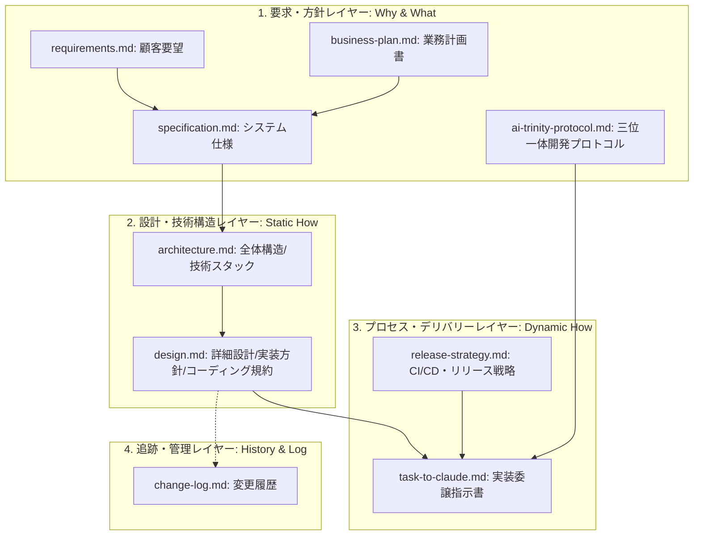

# ドキュメントマップ (Document Map) - Counail

本ドキュメントは、プロジェクト「Counail」におけるすべてのドキュメント資産をMECE（漏れなく、ダブりなく）に整理し、それぞれの役割と依存関係を定義した地図である。

---

## 1. ドキュメントのMECE分類マップ

プロジェクトドキュメントを「目的」と「性質」に基づいて4つのカテゴリに完全に分類し、責任境界を明確化する。

---

## 2. 各ドキュメントの定義と責任境界 (MECE定義)

### 2-1. 要求・方針レイヤー (Why & What)
システムの背景、目的、解決すべき課題、ビジネスモデル、および開発全体を律する基本方針。

| ファイル名 | 役割（責務） | 対象読者 | 重複を避けるための境界 |
|---|---|---|---|
| [requirements.md](file:///Users/niwa_kazuhiro/Documents/PrivateDevelop/Counail/docs/requirements.md) | 人間（顧客）による生の要望・要請の記録。 | 全員 | 技術的仕様や詳細なテーブル定義は記載しない。 |
| [business-plan.md](file:///Users/niwa_kazuhiro/Documents/PrivateDevelop/Counail/docs/business-plan.md) | ビジネスコンセプト、ターゲットユーザー、課金体系、収益化計画、法務要件などビジネス全体の方針定義。 | 全員 | システムの具体的なデータ構造や詳細な機能要件は記載しない。 |
| [specification.md](file:///Users/niwa_kazuhiro/Documents/PrivateDevelop/Counail/docs/specification.md) | 要望を論理的な機能・非機能要件に分解し、MVPの「実装境界（What）」を定義する。 | 全員 | 技術的な実装コード、特定のDBのDDLなどは記載しない。 |
| [ai-trinity-protocol.md](file:///Users/niwa_kazuhiro/Documents/PrivateDevelop/Counail/docs/ai-trinity-protocol.md) | 開発を行うエージェント（人間、Gemini、Claude）の役割定義、絶対原則、および5段階の開発ワークフロー定義。 | 全員 | 開発プロセス全般を統括し、個別の機能詳細設計やリリース手順は記載しない。 |

### 2-2. 設計・技術構造レイヤー (Static How - 静的設計)
仕様を実現するための技術的構成、静的な構造および品質定義。

| ファイル名 | 役割（責務） | 対象読者 | 重複を避けるための境界 |
|---|---|---|---|
| [architecture.md](file:///Users/niwa_kazuhiro/Documents/PrivateDevelop/Counail/docs/architecture.md) | システム全体のコンポーネント構成、俯瞰データフロー、技術スタックの定義。 | 開発者 | 個々のAPIのパラメータや具体的なテーブル物理スキーマは記載しない。 |
| [design.md](file:///Users/niwa_kazuhiro/Documents/PrivateDevelop/Counail/docs/design.md) | データベーススキーマ（DDL）、共通インターフェース仕様、非同期処理の実行サイクル、およびコーディング規約の定義。 | 開発者 | リリース手順やテストパイプラインなどのデリバリープロセスは記載しない。 |

### 2-3. プロセス・デリバリーレイヤー (Dynamic How - 動的プロセス)
システムを構築、テストし、最終的に本番へ届けるための動的な手順と連携方法。

| ファイル名 | 役割（責務） | 対象読者 | 重複を避けるための境界 |
|---|---|---|---|
| [task-to-claude.md](file:///Users/niwa_kazuhiro/Documents/PrivateDevelop/Counail/docs/task-to-claude.md) | 実装エージェント（Claude）に対し、Linearタスクの作成を委譲するための具体的な指示書。 | Claude | 他のドキュメントのコピーは含めず、設計・仕様ファイルへの参照リンクのみとする。 |
| [release-strategy.md](file:///Users/niwa_kazuhiro/Documents/PrivateDevelop/Counail/docs/release-strategy.md) | CI（静的解析・テスト自動化）の定義、およびCD（デプロイメント）とリリース運用（セマンティックバージョニングなど）の規約。 | 開発者・インフラ | ビジネス戦略やDBスキーマ詳細設計は記載しない。 |

### 2-4. 追跡・管理レイヤー (Track & History)
プロジェクトの履歴管理とトレーサビリティの確保。

| FILE | 役割（責務） | 対象読者 | 重複を避けるための境界 |
|---|---|---|---|
| [change-log.md](file:///Users/niwa_kazuhiro/Documents/PrivateDevelop/Counail/docs/change-log.md) | バージョンごとの更新履歴、適用された変更点、機能追加の履歴。 | 全員 | 設計変更の理由や将来の予定は書かず、適用された「実績」のみを記述する。 |

---

## 3. 統合・移行済みドキュメント（リダイレクト）
ドキュメントのダブり（重複）を排除し、MECEを維持するために以下の統合を行いました。

- **[ai-rules.md](file:///Users/niwa_kazuhiro/Documents/PrivateDevelop/Counail/docs/ai-rules.md)**: 包括的なプロトコルドキュメントである [ai-trinity-protocol.md](file:///Users/niwa_kazuhiro/Documents/PrivateDevelop/Counail/docs/ai-trinity-protocol.md) に完全統合されました。
- **[workflow.md](file:///Users/niwa_kazuhiro/Documents/PrivateDevelop/Counail/docs/workflow.md)**: [ai-trinity-protocol.md](file:///Users/niwa_kazuhiro/Documents/PrivateDevelop/Counail/docs/ai-trinity-protocol.md#L34) の「## ワークフロー（5 フェーズ）」セクションに完全統合されました。
- **[coding-standards.md](file:///Users/niwa_kazuhiro/Documents/PrivateDevelop/Counail/docs/coding-standards.md)**: [design.md](file:///Users/niwa_kazuhiro/Documents/PrivateDevelop/Counail/docs/design.md#L182) の「## 4. コーディング規約 (Coding Standards)」へ統合されました。
- **[ci-cd.md](file:///Users/niwa_kazuhiro/Documents/PrivateDevelop/Counail/docs/ci-cd.md)**: [release-strategy.md](file:///Users/niwa_kazuhiro/Documents/PrivateDevelop/Counail/docs/release-strategy.md#L17) の「## 2. CI (継続的インテグレーション) 設計」および「## 3. CD (継続的デリバリー) 設計」へ統合されました。
